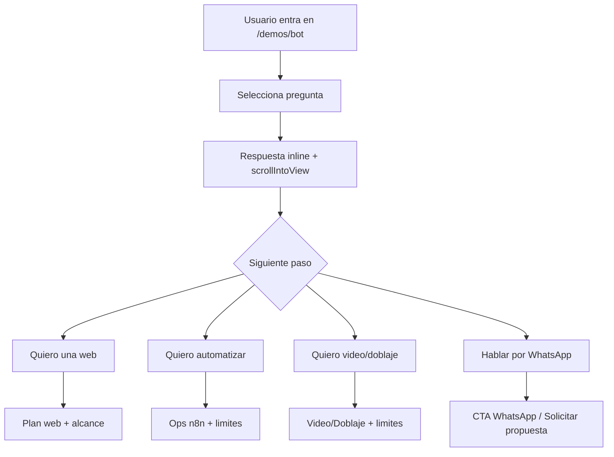
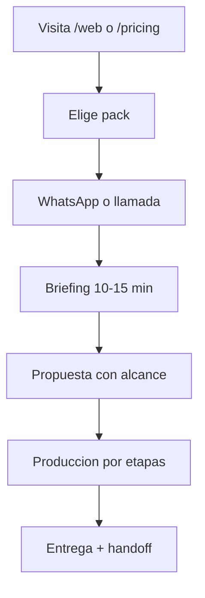
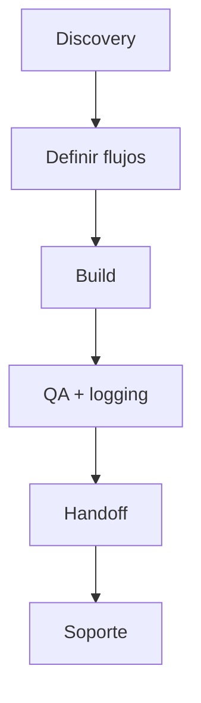

# Flows (Mermaid)

## FAQ Bot demo

```mermaid
flowchart TD
  A[Usuario entra en /demos/bot] --> B[Selecciona pregunta]
  B --> C[Respuesta inline + scrollIntoView]
  C --> D{Siguiente paso}
  D --> E[Quiero una web]
  D --> F[Quiero automatizar]
  D --> G[Quiero video/doblaje]
  D --> H[Hablar por WhatsApp]
  E --> I[Plan web + alcance]
  F --> J[Ops n8n + limites]
  G --> K[Video/Doblaje + limites]
  H --> L[CTA WhatsApp / Solicitar propuesta]
```

## Funnel Web

```mermaid
flowchart TD
  A[Visita /web o /pricing] --> B[Elige pack]
  B --> C[WhatsApp o llamada]
  C --> D[Briefing 10-15 min]
  D --> E[Propuesta con alcance]
  E --> F[Produccion por etapas]
  F --> G[Entrega + handoff]
```

## Flow Ops (n8n)

```mermaid
flowchart TD
  A[Discovery] --> B[Definir flujos]
  B --> C[Build]
  C --> D[QA + logging]
  D --> E[Handoff]
  E --> F[Soporte]
```
