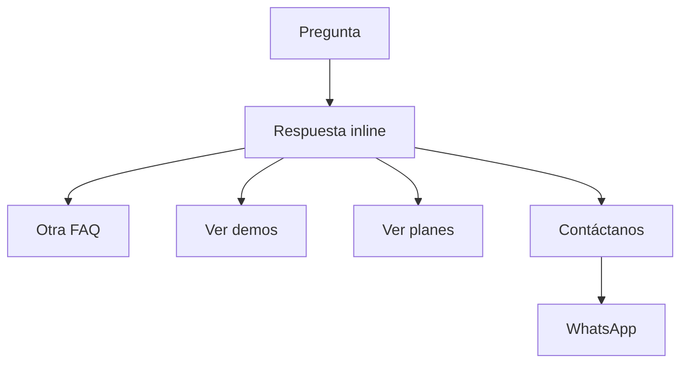

# FAQ_FLOW

```mermaid
graph TD
  Q1[Pregunta] --> A1[Respuesta inline]
  A1 --> Q2[Otra FAQ]
  A1 --> D1[Ver demos]
  A1 --> P1[Ver planes]
  A1 --> C1[Contáctanos]
  C1 --> WhatsApp[WhatsApp]
```
