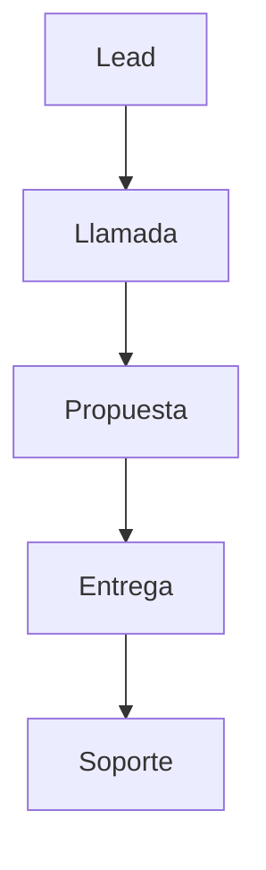
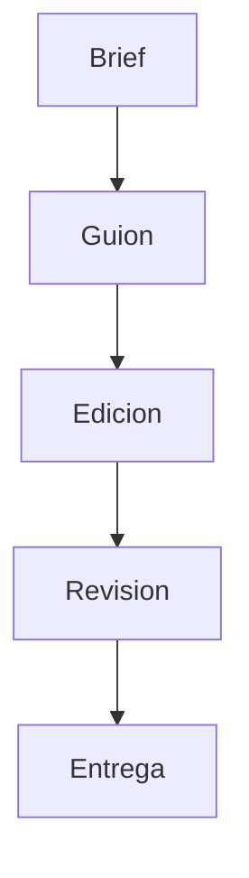
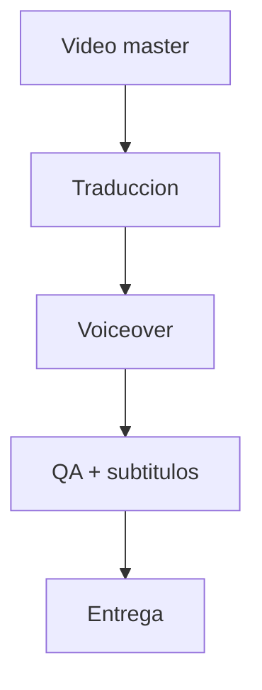

# FLOWCHARTS

## Flujo de venta


## Flujo producción video


## Flujo doblaje


## Arbol FAQ bot (10 preguntas)
```mermaid
graph TD
  Q1[Inicio] --> Q2[Plazos]
  Q1 --> Q3[Alcance]
  Q3 --> Q4[Revisiones]
  Q4 --> Q5[Integraciones]
  Q5 --> Q6[Soporte]
  Q6 --> Q7[Cambios posteriores]
  Q7 --> Q8[Privacidad]
  Q8 --> Q9[Canales]
  Q9 --> Q10[Proximos pasos]
  Q10 --> CTA1[WhatsApp]
  Q10 --> CTA2[/contact]
```
