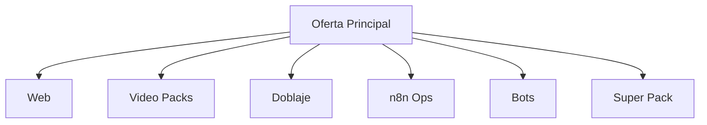

# WEB__FLOWS

## Funnel /web
```mermaid
graph TD
  A[Landing /web] --> B[CTA WhatsApp]
  A --> C[Reservar llamada]
  C --> D[/contact]
  B --> E[WhatsApp Chat]
```

## FAQ Demo Bot
```mermaid
graph TD
  Q1[Pregunta] --> A1[Respuesta]
  A1 --> R1[Quiero una web]
  A1 --> R2[Quiero automatizar n8n]
  A1 --> R3[Quiero video/doblaje]
  A1 --> R4[Hablar por WhatsApp]
  R1 --> CTA1[/web]
  R2 --> CTA2[/ops]
  R3 --> CTA3[/video]
  R4 --> CTA4[WhatsApp]
```

## Oferta general

